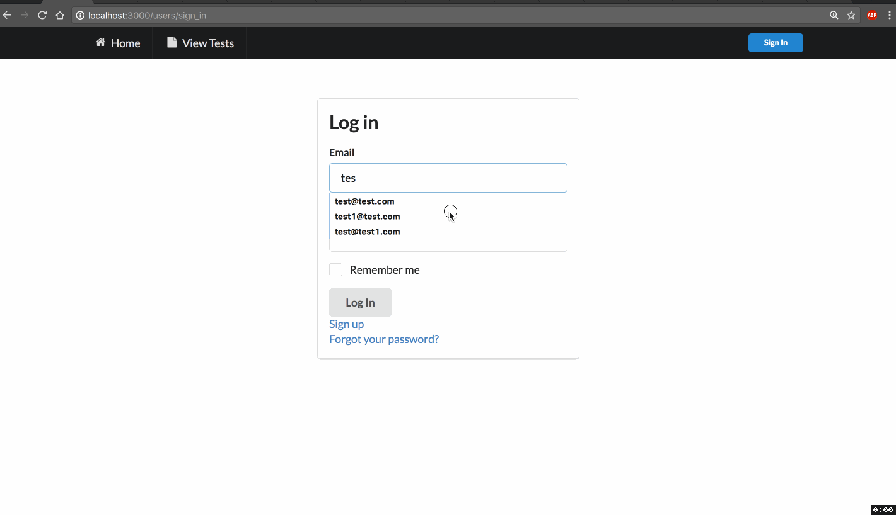

LangLog

An extension of my "LearnChinese" app with a test. 

## User Stories

### Features:

* [x] User log in — devise (admin, sessions, etc)
* [x] Can create new word
* [x] Tracks how many words are added per day
* [x] Test that randomly generates questions (based on test-type)

Log:
- Don't use scaffold - better to customize. When destroying scaffold, destroy table first, then destroy scaffold
- playing with jsonb to store hash or array in table column

Problems
- Nov 5 upon logging out still shows words. should take to new session 

### Desired Features:
- As more tests are taken, the number of times a word is tested, determines its 'weight.' Higher 'weight' means less likely to be tested in the future (meaning it is more committed to memory). But specific to the type of test. 
- can separate by language

## Video Walkthrough

Here's a walkthrough of implemented user stories (as of Nov 9, 2017):

GIF created with [LiceCap](http://www.cockos.com/licecap/).

## Notes

##MISC:

* Ruby version 2.3.0
* Semantic UI
* Gems - Groupdate, Devise, Chartkick

## License

    Copyright [2017] [name]

    Licensed under the Apache License, Version 2.0 (the "License");
    you may not use this file except in compliance with the License.
    You may obtain a copy of the License at

        http://www.apache.org/licenses/LICENSE-2.0

    Unless required by applicable law or agreed to in writing, software
    distributed under the License is distributed on an "AS IS" BASIS,
    WITHOUT WARRANTIES OR CONDITIONS OF ANY KIND, either express or implied.
    See the License for the specific language governing permissions and
    limitations under the License.
